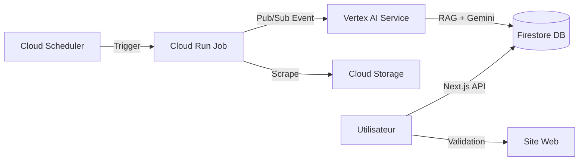

```markdown
# 🤖 SEO Autonome Platform (Agentic AI)

> Une application d'audit et d'optimisation SEO continue, pilotée par l'Intelligence Artificielle (Google Vertex AI) et une architecture événementielle sur Google Cloud Platform.

## 📋 Vue d'ensemble

Ce projet n'est pas un simple outil d'analyse. C'est une plateforme **Agentique** capable de :
1.  **Observer** un site web en temps réel (Crawler Playwright).
2.  **Analyser** les opportunités SEO sémantiques et techniques (Gemini Pro 1.5).
3.  **Proposer** des modifications concrètes (Architecture RAG).
4.  **Agir** après validation humaine (Boucle Human-in-the-loop).

## 🏗 Architecture Technique

L'application suit une architecture micro-services hébergée sur GCP :



### Stack Technologique

*   **Frontend / API Gateway :** Next.js 16 (App Router), React 19, Recharts.
*   **Base de Données :** Google Firestore (NoSQL) & Cloud Storage.
*   **Acquisition (Les Yeux) :** Node.js + Playwright (Cloud Run Jobs).
*   **Intelligence (Le Cerveau) :** Google Vertex AI (Gemini Pro), Vector Search (RAG).
*   **Orchestration :** Google Cloud Pub/Sub & Cloud Scheduler.
*   **Infrastructure :** Terraform / gcloud CLI.

---

## 🚀 Installation & Démarrage Local

### 1. Prérequis
*   Node.js 20+
*   Compte Google Cloud Platform actif
*   Google Cloud CLI (`gcloud`) installé
*   Firebase CLI installé

### 2. Configuration de l'environnement
Clonez le repo et installez les dépendances racines (Frontend) :
```bash
git clone https://github.com/votre-user/seo-autonome.git
cd seo-autonome
npm install
```

Créez un fichier `.env.local` à la racine :
```env
# Firebase Client (Frontend)
NEXT_PUBLIC_FIREBASE_API_KEY=votre_api_key
NEXT_PUBLIC_FIREBASE_PROJECT_ID=votre_project_id

# Service Account (Backend API Routes)
GOOGLE_APPLICATION_CREDENTIALS="./service-account-key.json"
```

### 3. Installation des Micro-services
Le backend est modulaire. Installez les dépendances pour chaque service :

```bash
# Crawler Service
cd backend/services/crawler
npm install

# AI Analyzer Service
cd ../ai-analyzer
npm install
```

### 4. Peupler la Base de Données (Seed)
Pour ne pas partir de zéro, injectez des données de démonstration :
```bash
node backend/scripts/seed-db.js
```

### 5. Lancer le Frontend
```bash
npm run dev
```
L'application est accessible sur `http://localhost:3000`.

---

## 🧠 Fonctionnement des Modules

### 1. Le Module d'Audit (`/backend/services/crawler`)
Un job Dockerisé utilisant **Playwright**. Il navigue comme un véritable utilisateur, exécute le JS, capture le HTML rendu, et mesure les Core Web Vitals.
*   *Trigger :* Cloud Scheduler ou API manuelle.
*   *Output :* HTML dans Cloud Storage + Métriques dans Firestore.

### 2. Le Module d'Analyse IA (`/backend/services/ai-analyzer`)
Le cerveau du système. Il est déclenché via **Pub/Sub** dès qu'un audit est terminé.
*   *Logique :* Récupère le HTML -> Récupère le contexte (RAG) -> Construit le prompt pour Gemini -> Génère un JSON de propositions.
*   *Output :* Documents dans la collection `proposals`.

### 3. La Base de Connaissance (RAG)
Située dans `knowledge_base`, elle contient les guidelines de la marque (Tone of Voice) et les règles SEO strictes sous forme de vecteurs. L'IA consulte cette base avant de faire une proposition.

---

## ☁️ Déploiement sur Google Cloud

### Déploiement du Frontend (Cloud Run)
```bash
gcloud run deploy seo-frontend --source . --platform managed --allow-unauthenticated
```

### Déploiement du Crawler (Cloud Run Job)
```bash
cd backend/services/crawler
gcloud run jobs deploy seo-crawler --source . --tasks 1 --max-retries 0
```

### Déploiement de l'Infrastructure (Pub/Sub & Scheduler)
Exécutez le script d'automatisation :
```bash
sh backend/infrastructure/setup-infrastructure.sh
```

---

## 🛡 Sécurité

*   **RBAC :** Règles Firestore (`firestore.rules`) assurant que chaque utilisateur ne voit que ses propres sites.
*   **Auth :** Authentification gérée par Firebase Auth.
*   **Secrets :** Gestion des clés API via Google Secret Manager (en production).

## 📄 Licence

Propriétaire - Tous droits réservés.
```